# Azure Immutable Backup

## Introduction

This repository is a blueprint accelerator solution that supports teams in taking immutable backups in Azure. It's aim is to give developers tooling and templates that can be used to create, configure and manage immutable backups using Azure Backup Vault.

The following technologies are used:

* Azure
* Azure CLI
* Azure Pipelines
* Terraform
* Go (used for end-to-end testing)

### Outstanding Questions

* The design doesn't cater for the requirement to store the backup data in a separate account (or subscription in Azure lingo). We can however support GeoRedundant storage across regions - will this suffice? Otherwise we need to look at a solution for this problem.
* The design currently caters for a scenario where a vault could be unlocked initially, and later locked. Do we want this?

## Design

### Azure Architecture

A solution which utilises the blueprint will consist of the following types of Azure resources

* Azure backup vault and backup policies/instances
* Azure policy definitions and assignments
* Azure monitor
* Entra ID
* Tfstate storage account
* Resources that need to be backed up

The following diagram illustrates the high level architecture:


1. The **backup vault** stores the backups of a variety of different Azure resources. A number of **backup instances** are created in the vault, which have a policy applied that defines the configuration for a backup such as the retention period and schedule. The vault is configured as **immutable** and **locked** to enforce tamper proof backups. The **backup vault** resides in it's own isolated **resource group**.

1. **Backup instances** link the resources to be backed up and an associated **backup policy**, and one registered trigger the backup process. The resources directly supported are Azure Blob Storage, Managed Disks, PostgreSQL (single server and flexible server) and AKS instances, although other resources are supported indirectly through Azure Storage (see **point 7** for more details). **Backup instances** are created based on the variables supplied to module, which include configuration and details of the resources that need to be backed up.

1. The **backup vault** accesses resources to be backed up through a **System Assigned Managed Identity** - a secure way of enabling communication between defined resources without managing a secret/password, which is assigned the necessary roles to the resources that require backup.

1. **Backup administrators** are a group of identities that will have time limited read only access to the **backup vault** in order to access and restore backups as required. Assignment of the role will be secured by **PIM** - Privileged Identity Management, which requires a second identity to authorise the role assignment, which is then assigned on a time limited bases. The **backup administrators** will also be responsible for monitoring and auditing backup activity via **Azure Monitor** (see **point 6** for more details).

1. The solution requires a user account with elevated subscription contributor permissions that can create the backup resources (such as the backup **resource group** and **backup vault**) and assign roles to the resources that require backup. This identity will be implemented as a **federated credential** of an **app registration**, which is like a passport that lets you access different services without needing a separate password. This removes the need to manage a secret/password once configured. The identity also needs writer access to a dedicated **Storage Account** in order to read and write the **terraform** infrastructure state.

1. All backup telemetry will flow into **Azure Monitor** for monitoring and auditing purposes. This will provide access to data such as backup logs and metrics, and provide observability over the solution. Should the need arise, the telemetry could also be integrated into an external monitoring solution.

1. Some resources such as Azure SQL and Azure Key Vault are not directly supported by Azure **backup vault**, but can be incorporated via a supplementary process that backs up the data to Azure Blob Storage first. In the case of Azure SQL, a typical scenario could be an Azure Logic App that takes a backup of Azure SQL on a regular basis and stores the data in Azure Blob Storage.  It is the aspiration of this solution to provide guidance and tooling that teams can adopt to support these scenarios.

### Terraform Design

The following diagram illustrates the terraform design:



1. The **az-backup** module is essentially everything within the `./infrastructure` directory of this repository. It consists of the following resources:
   * A **resource group** which will contain _most_ of the other resources in the module.
   * A **backup vault** within which backup policies and instances are configured..
   * A **role assignment** which provides read access to the vault.
   * A number of **backup modules** which can backup a specific type of resource.

1. **Backup modules** are created which define policies that setup and trigger the backups once the module is deployed. The policies which are configured via terraform variables.

1. Each **backup module** deploys the resources that are required to backup a resource that contains source data (e.g. a storage account). It consists of a **backup policy** that is configured in the **backup vault** on deployment and defines the rules such as backup retention and schedule, and an **backup instance** that applies the policy and initiates the backups of a specified resource.

1. The **consuming application** is developed and maintained by the blueprint consumer. It will likely consist of a number of resource that make up an application or service, and contain resources that need to be backed up. The recommended way of using **az-backup** in the **consuming application** is to specify the blueprint repository as the remote source of a terraform module. [See the following link for more information.](https://developer.hashicorp.com/terraform/language/modules/sources)

1. The **az-backup** module is configured by terraform variables which are applied at deployment time. The **consuming application** can control parameters such as the vault name, location and redundancy, as well as the backup policies and their retention period and schedule. See the [module variables](#module-variables) section for more details.

### Pipelines

> TODO

## Usage

To use the az-backup terraform module, create a module in your code and set the source as this repository.

[See the following link for more information about using github as the source of a terraform module.](https://developer.hashicorp.com/terraform/language/modules/sources#github)

The repository is currently public so no authentication is needed, however the az-backup module resides in the `infrastructure` sub directory of the repository, so you need to specify that in the module source and [use the double-slash syntax as explained in this guide](https://developer.hashicorp.com/terraform/language/modules/sources#modules-in-package-sub-directories).

In future we will use release tags to ensure consumers can depend on a specific release of the module, however this has not currently been implemented.

### Example

The following is an example of how the module should be used:

```terraform
module "my_backup" {
  source           = "github.com/nhsdigital/az-backup//infrastructure"
  vault_name       = "myvault"
  vault_location   = "uksouth"
  vault_redundancy = "LocallyRedundant"
  blob_storage_backups = {
    backup1 = {
      backup_name        = "storage1"
      retention_period   = "P7D"
      storage_account_id = azurerm_storage_account.my_storage_account_1.id
    }
    backup2 = {
      backup_name        = "storage2"
      retention_period   = "P30D"
      storage_account_id = azurerm_storage_account.my_storage_account_2.id
    }
  }
  managed_disk_backups = {
    backup1 = {
      backup_name      = "disk1"
      retention_period = "P7D"
      backup_intervals = ["R/2024-01-01T00:00:00+00:00/P1D"]
      managed_disk_id  = azurerm_managed_disk.my_managed_disk_1.id
      managed_disk_resource_group = {
        id   = azurerm_resource_group.my_resource_group.id
        name = azurerm_resource_group.my_resource_group.name
      }
    }
    backup2 = {
      backup_name      = "disk2"
      retention_period = "P30D"
      backup_intervals = ["R/2024-01-01T00:00:00+00:00/P2D"]
      managed_disk_id  = azurerm_managed_disk.my_managed_disk_2.id
      managed_disk_resource_group = {
        id   = azurerm_resource_group.my_resource_group.id
        name = azurerm_resource_group.my_resource_group.name
      }
    }
  }

}
```

### Deployment Service Principal

To deploy the module an Azure identity is required which has been assigned the following roles at the subscription level:

* Contributor (required to create resources)
* Role Based Access Control Administrator (to assign roles to the backup vault managed identity)
  * **With a condition that limits the roles which can be assigned to:**
    * Storage Account Backup Contributor
    * Disk Snapshot Contributor
    * Disk Backup Reader

### Module Variables

| Name | Description | Mandatory | Default |
|------|-------------|-----------|---------|
| `vault_name` | The name of the backup vault. The value supplied will be automatically prefixed with `rg-nhsbackup-`. If more than one az-backup module is created, this value must be unique across them. | Yes | n/a |
| `vault_location` | The location of the resource group that is created to contain the vault. | No | `uksouth` |
| `vault_redundancy` | The redundancy of the vault, e.g. `GeoRedundant`. [See the following link for the possible values](https://registry.terraform.io/providers/hashicorp/azurerm/latest/docs/resources/data_protection_backup_vault#redundancy) | No | `LocallyRedundant` |
| `blob_storage_backups` | A map of blob storage backups that should be created. For each backup the following values should be provided: `storage_account_id`, `backup_name` and `retention_period`. When no value is provided then no backups are created. | No | n/a |
| `blob_storage_backups.storage_account_id` | The id of the storage account that should be backed up. | Yes | n/a |
| `blob_storage_backups.backup_name` | The name of the backup, which must be unique across blob storage backups. | Yes | n/a |
| `blob_storage_backups.retention_period` | How long the backed up data will be retained for, which should be in `ISO 8601` duration format. [See the following link for the possible values](https://en.wikipedia.org/wiki/ISO_8601#Durations). | Yes | n/a |
| `managed_disk_backups` | A map of managed disk backups that should be created. For each backup the following values should be provided: `managed_disk_id`, `backup_name` and `retention_period`. When no value is provided then no backups are created. | No | n/a |
| `managed_disk_backups.managed_disk_id` | The id of the managed disk that should be backed up. | Yes | n/a |
| `managed_disk_backups.backup_name` | The name of the backup, which must be unique across managed disk backups. | Yes | n/a |
| `managed_disk_backups.retention_period` | How long the backed up data will be retained for, which should be in `ISO 8601` duration format. [See the following link for the possible values](https://en.wikipedia.org/wiki/ISO_8601#Durations). | Yes | n/a |
| `managed_disk_backups.backup_intervals` | A list of intervals at which backups should be taken, which should be in `ISO 8601` duration format. [See the following link for the possible values](https://en.wikipedia.org/wiki/ISO_8601#Time_intervals). | Yes | n/a |

## Developer Guide

The following guide is for developers working on the blueprint solution - not for developers that are consuming the blueprint.

### Repository Structure

The repository consists of the following directories:

* `./.github`
  
  Contains the GitHub workflows in `yaml` format.
  
  [See the YAML schema documentation for more details.](https://learn.microsoft.com/en-us/azure/devops/pipelines/yaml-schema/?view=azure-pipelines)

* `./.pipelines`
  
  Contains the Azure Pipelines in `yaml` format.
  
  [See the YAML schema documentation for more details.](https://learn.microsoft.com/en-us/azure/devops/pipelines/yaml-schema/?view=azure-pipelines)

* `./docs`

  Stores files and assets related to the documentation.

* `./infrastructure`

  Stores the infrastructure as code - a set of terraform scripts and modules.
  
  [See the Terraform AzureRM documentation for more details.](https://registry.terraform.io/providers/hashicorp/azurerm/latest/docs)

  [Also see the backup instance for blob storage as an example of the all the components that make up a blob storage backup.](https://registry.terraform.io/providers/hashicorp/azurerm/latest/docs/resources/data_protection_backup_instance_blob_storage)

* `./scripts`

  Contains scripts that are used to create and maintain the environment.

* `./tests`

  Contains the different types of tests used to verify the solution.

### Environment Setup

The following are pre-requisites to working with the solution:

* An Azure subscription for development purposes
* An Azure identity which has been assigned the following roles at the subscription level:
  * Contributor (required to create resources)
  * Role Based Access Control Administrator (to assign roles to the backup vault managed identity)
    * **Add a condition that limits the roles which can be assigned to:**
      * Storage Account Backup Contributor
      * Disk Snapshot Contributor
      * Disk Backup Reader
* [Azure CLI installed](https://learn.microsoft.com/en-us/cli/azure/install-azure-cli-windows?tabs=azure-cli)
* [Terraform installed](https://developer.hashicorp.com/terraform/install)
* [Go installed (to run the end-to-end tests)](https://go.dev/dl/)

Ensure all installed components have been added to the `%PATH%` - e.g. `az`, `terraform` and `go`.

### Getting Started

Take the following steps to get started in configuring and verifying the infrastructure for your development environment:

1. Setup environment variables

   Set the following environment variables in order to connect to Azure in the following steps:

   ```pwsh
   $env:ARM_TENANT_ID="<your-tenant-id>"
   $env:ARM_SUBSCRIPTION_ID="<your-subscription-id>"
   $env:ARM_CLIENT_ID="<your-client-id>"
   $env:ARM_CLIENT_SECRET="<your-client-secret>"
   ```

1. Create Backend

   A backend (e.g. storage account) is required in order to store the tfstate and work with Terraform.

   Run the following powershell script to create the backend with default settings: `./scripts/create-tf-backend.ps1`. This script will create a resource group called `rg-nhsbackup` containing a storage account called `satfstate<random-id>`.

   Make a note of the name of the storage account in the script output - it's generated with a random suffix, and you'll need it in the following steps to initialise the terraform.

1. Prepare Terraform Variables (Optional)

   If you want to override the Terraform variables, make a copy of `tfvars.template` and amend any default settings as required.

   In the next step add the following flag to the `terraform apply` command in order to use your variables:

   ```pwsh
   -var-file="<your-var-file>.tfvars
   ```

1. Initialise Terraform

   Change the working directory to `./infrastructure`.

   Terraform can now be initialised by running the following command:

   ````pwsh
   terraform init -backend=true -backend-config="resource_group_name=rg-nhsbackup" -backend-config="storage_account_name=<storage-account-name>" -backend-config="container_name=tfstate" -backend-config="key=terraform.tfstate"
   ````

1. Apply Terraform

   Apply the Terraform code to create the infrastructure.

   The `-auto-approve` flag is used to automatically approve the plan, you can remove this flag to review the plan before applying.

   ```pwsh
   terraform apply -auto-approve
   ```

   Now review the deployed infrastructure in the Azure portal. You will find the resources deployed to a resource group called `rg-nhsbackup-myvault` (unless you specified a different vault name in the tfvars).

   Should you want to, you can remove the infrastructure with the following command:

   ```pwsh
   terraform destroy -auto-approve
   ```

### Integration Tests

The test suite consists of a number Terraform HCL integration tests that use a mock azurerm provider.

[See this link for more information.](https://developer.hashicorp.com/terraform/language/tests)

> TIP! Consider adopting the classic red-green-refactor approach using the integration test framework when adding or modifying the terraform code.

Take the following steps to run the test suite:

1. Initialise Terraform

   Change the working directory to `./tests/integration-tests`.

   Terraform can now be initialised by running the following command:

   ````pwsh
   terraform init -backend=false
   ````

   > NOTE: There's no need to initialise a backend for the purposes of running the tests.

1. Run the tests

   Run the tests with the following command:

   ````pwsh
   terraform test
   ````

### End to End Tests

The end to end tests are written in go, and use the [terratest library](https://terratest.gruntwork.io/) and the [Azure SDK for Go](https://github.com/Azure/azure-sdk-for-go/tree/main).

The tests depend on a connection to Azure so it can create an environment that the tests can be executed against - the environment is torn down once the test run has completed.

See the following resources for docs and examples of terratest and the Azure SDK:

[Terratest docs](https://terratest.gruntwork.io/docs/)
[Terratest repository](https://github.com/gruntwork-io/terratest)
[Terratest test examples](https://github.com/gruntwork-io/terratest/tree/master/test)
[Azure SDK](https://github.com/Azure/azure-sdk-for-go/tree/main)
[Azure SDK Data Protection Module](https://github.com/Azure/azure-sdk-for-go/tree/main/sdk/resourcemanager/dataprotection/armdataprotection)

To run the tests, take the following steps:

1. Install go packages

   You only need to do this once when setting up your environment.

   Change the working directory to `./tests/end-to-end-tests`.

   Run the following command:

   ````pwsh
   go mod tidy
   ````

1. Setup environment variables

   The end-to-end test suite needs to login to Azure in order to execute the tests and therefore the following environment variables must be set.

   ```pwsh
   $env:ARM_TENANT_ID="<your-tenant-id>"
   $env:ARM_SUBSCRIPTION_ID="<your-subscription-id>"
   $env:ARM_CLIENT_ID="<your-client-id>"
   $env:ARM_CLIENT_SECRET="<your-client-secret>"
   $env:TF_STATE_RESOURCE_GROUP="rg-nhsbackup"
   $env:TF_STATE_STORAGE_ACCOUNT="<storage-account-name>"
   $env:TF_STATE_STORAGE_CONTAINER="tfstate"
   ```

   > For the storage account name, the TF state backend should have been created during the [getting started guide](#getting-started), at which point the storage account will have been created and the name generated.

1. Run the tests

   Run the tests with the following command:

   ````pwsh
   go test -v -timeout 10m
   ````

#### Debugging

To debug the tests in vscode, add the following configuration to launch settings and run the configuration with the test file you want to debug open:

```json
{
    "configurations": [
        {
            "name": "Go Test",
            "type": "go",
            "request": "launch",
            "mode": "test",
            "program": "${file}",
            "env": {
                "ARM_TENANT_ID": "<your-tenant-id>",
                "ARM_SUBSCRIPTION_ID": "<your-subscription-id>",
                "ARM_CLIENT_ID": "<your-client-id>",
                "ARM_CLIENT_SECRET": "<your-client-secret>",
                "TF_STATE_RESOURCE_GROUP": "rg-nhsbackup",
                "TF_STATE_STORAGE_ACCOUNT": "<storage-account-name>",
                "TF_STATE_STORAGE_CONTAINER": "tfstate"
            }
        }       
    ]
}
```

> For the storage account name, the TF state backend should have been created during the [getting started guide](#getting-started), at which point the storage account will have been created and the name generated.

### CI Pipeline

The CI pipeline builds and verifies the solution and runs a number of static code analysis steps on the code base.

Part of the build verification is end to end testing. This requires the pipeline to login to Azure and deploy an environment on which to execute the tests. In order for the pipeline to login to Azure the following GitHub actions secrets must be created:

* `AZURE_TENANT_ID`
  The ID of an Azure tenant which can be used for the end to end test environment.

* `AZURE_SUBSCRIPTION_ID`
  The ID of an Azure subscription which can be used for the end to end test environment.

* `AZURE_CLIENT_ID`
  The client ID of an Azure service principal / app registration which can be used to authenticate with the end to end test environment.
  
  The app registration must have contributor permissions on the subscription in order to create resources.

* `AZURE_CLIENT_SECRET`
  The client secret of an Azure app registration which can be used to authenticate with the end to end test environment.

* `TF_STATE_RESOURCE_GROUP`
  The resource group which contains the TF state storage account.

* `TF_STATE_STORAGE_ACCOUNT`
  The storage account used for TF state.

* `TF_STATE_STORAGE_COMTAINER`
  The storage container used for TF state.

#### Static Code Analysis

The following static code analysis checks are executed:

* [Terraform format](https://developer.hashicorp.com/terraform/cli/commands/fmt)
* [Terraform lint](https://github.com/terraform-linters/tflint)
* [Checkov scan](https://www.checkov.io/)
* [Gitleaks scan](https://github.com/gitleaks/gitleaks)
* [Trivy vulnerability scan](https://github.com/aquasecurity/trivy)

### Contributing

If you want to contribute to the project, raise a PR on GitHub.

We use pre-commit to run analysis and checks on the changes being committed. Take the following steps to ensure the pre-commit hook is installed and working:

1. Install git
    * Ensure the git `bin` directory has been added to %PATH%: `C:\Program Files\Git\bin`

1. Install Python
    * Ensure the python `bin` directory has been added to %PATH%

1. Install pre-commit
    * Open a terminal and navigate to the repository root directory
    * Install pre-commit with the following command: `pip install pre-commit`
    * Install pre-commit within the repository with the following command: `pre-commit install`
    * Run `pre-commit run --all-files` to check pre-commit is working

> For full details [see this link](https://pre-commit.com/#installation)
