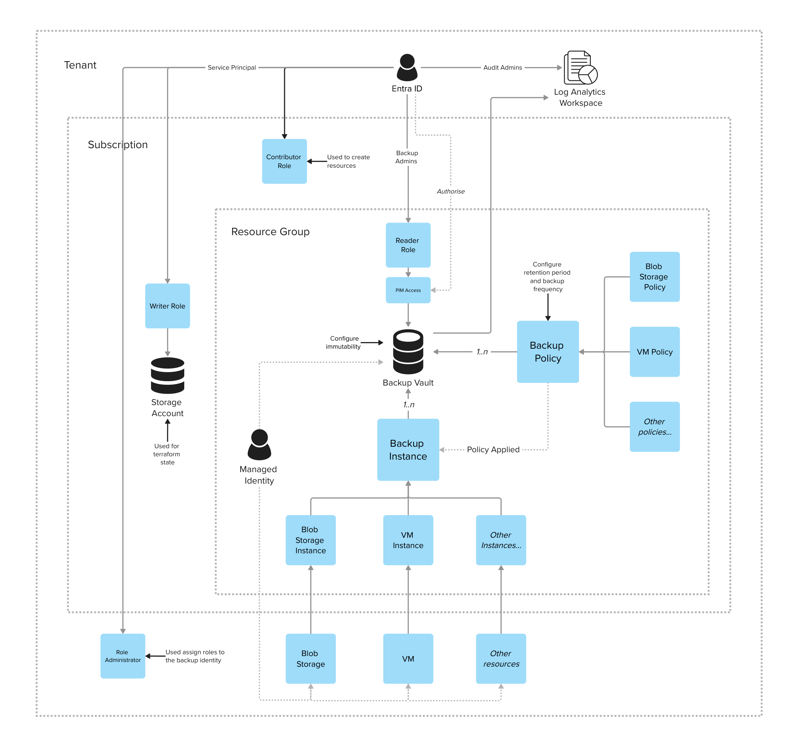
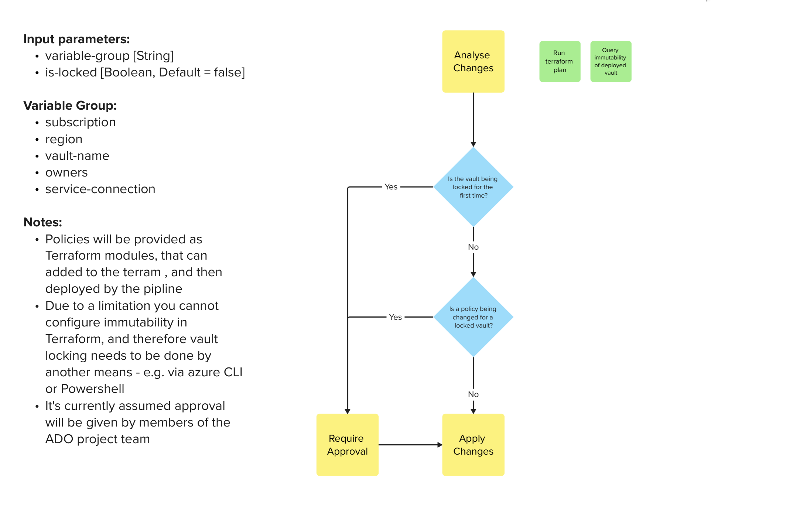

# Azure Immutable Backup

## Introduction

This repository is a blueprint solution for deploying immutable backups to Azure. It's aim is to give developers tooling and templates that can be used to create, configure and manage immutable backups using Azure Backup Vault and Azure Recovery Services Vault.

The following technologies are used:

* Azure
* Azure Pipelines
* Azure CLI
* Terraform

### Outstanding Questions

* The design currently caters for a scenario where a vault could be unlocked initially, and later locked. Do we want this?
* The design assumes that it is the responsibility of this solution to assign roles to resources-to-be-backed-up, which requires elevated privileges in the subscription that those resources reside. Do we want this?
* Do we want to prefix backup resources in the TF modules - thus enforcing the prefix convention, or allow module consumers to specify the full resource name - thus giving flexibility.

### Known Issues

* The Terraform AzureRM resource for a data protection backup vault does not currently have support for configuration of immutability, therefore this will setting will need to be configured in a different way (e.g. via pipelines/API call).
  * [See this github issue requesting support is added.](https://github.com/hashicorp/terraform-provider-azurerm/issues/22238)

## Design

The repository consists of:

* Terraform modules to create the infrastructure
* Azure Pipelines to manage the deployment

### Infrastructure

A typical backup solution that utilises this blueprint will consist of a number of Azure resources that must be created and managed in different ways:

* Tenant and subscription level resources
  * With the exception of the tfstate storage account, the following resources must be created manually:
    * The resources required to be backed up
    * A service principal used for deployment, with the following permissions:
      * Create resources
      * Assign roles on the backup resources
* Tfstate storage account
  * This must be created once during environment setup - see Developer Guide below for more details
* Backup vault and associated policies/instances
  * These are defined in the terraform scripts in this repo
  * The scripts should be customised for the specific use case and deployed via a deployment pipeline (or `terraform apply` in dev scenario)
  * A resource group is created which all backup resources reside within



### Pipelines

> This section is still in **DRAFT**.

The following diagram illustrates the pipeline design:



## Repository Structure

The repository consists of the following directories:

* `./.pipelines`
  
  Contains the Azure Pipelines in `yaml` format.
  
  [See the YAML schema documentation for more details.](https://learn.microsoft.com/en-us/azure/devops/pipelines/yaml-schema/?view=azure-pipelines)

* `./docs`

  Stores files and assets related to the documentation.

* `./infrastructure`

  Stores the infrastructure as code - a set of terraform scripts and modules.
  
  [See the Terraform AzureRM documentation for more details.](https://registry.terraform.io/providers/hashicorp/azurerm/latest/docs)

  [Also see the backup instance for blob storage as an example of the all the components that make up a blob storage backup.](https://registry.terraform.io/providers/hashicorp/azurerm/latest/docs/resources/data_protection_backup_instance_blob_storage)

* `./scripts`

  Contains scripts that are used to create and maintain the environment.

## Developer Guide

### Environment Setup

The following are pre-reqs to working with the solution:

* An Azure subscription
* Azure CLI installed
* Terraform installed
* An Azure identity with the following roles:
  * Contributor role on the subscription (required to create resources)
  * RBAC Administrator role on the resources being backed up (required to assign roles on the resource to the backup vault managed identity)

[See the following link for further information.](https://learn.microsoft.com/en-us/azure/developer/terraform/get-started-windows-powershell)

#### Contributing

If you want to contribute to the project you need to install [git](https://git-scm.com), [python](https://www.python.org/) and [pre-commit](https://pre-commit.com/).

Once pre-commit is installed, open a terminal, navigate to the repository root and run the following command to install the pre-commit hooks:

```cmd
pre-commit install
```

### Configuration

Take the following steps to configure and verify the infrastructure:

1. Login to Azure

   Use the Azure CLI to login to Azure by running the following command:

   ```pwsh
   az login
   ```

2. Create Backend

   A backend (e.g. storage account) is required in order to store the tfstate and work with Terraform.

   Run the following powershell script to create the backend with default settings: `./scripts/create-tf-backend.ps1`.

   Make a note of the name of the storage account - it's generated with a random suffix, and you'll need it in the following steps.

3. Create Access Key

   An access key must be created as an environment variable so Terraform can authenticate with Azure.

   Run the following commands to generate an access key and store it as an environment variable:

   ```pwsh
   $ACCOUNT_KEY=$(az storage account keys list --resource-group "rg-nhsbackup" --account-name "<storage-account-name>" --query '[0].value' -o tsv)

   $env:ARM_ACCESS_KEY=$ACCOUNT_KEY
   ```

4. Prepare Terraform Variables (Optional)

   If you want to override the Terraform variables, make a copy of `tfvars.template` and amend any default settings as required.

   In the next step add the following flag to the `terraform apply` command in order to use your variables:

   ```pwsh
   -var-file="<your-var-file>.tfvars
   ```

5. Initialise Terraform

   Change the working directory to `./infrastructure`.

   Terraform can now be initialised by running the following command:

   ````pwsh
   terraform init -backend=true -backend-config="resource_group_name=rg-nhsbackup" -backend-config="storage_account_name=<storage-account-name>" -backend-config="container_name=tfstate" -backend-config="key=terraform.tfstate"
   ````

6. Apply Terraform

   Apply the Terraform code to create the infrastructure.

   The `-auto-approve` flag is used to automatically approve the plan, you can remove this flag to review the plan before applying.

   ```pwsh
   terraform apply -auto-approve
   ```

   Now review the deployed infrastructure in the Azure portal. You will find a dummy scenario consisting of some storage accounts and a managed disk, with a backup vault, backup policies and some sample backup instances.

## Usage

To customise the solution and apply it to your own use case take the following steps:

1. Analyse Requirements

   Identify the resources you want to backup, the schedule on which you need take backups and how long you need to retain the backups (the retention period).

2. Plan and Design

   Review main.tf which contains some dummy example resources and sample backup policy/instance modules that can be adapted. Review and understand these modules, as you will need to customise and adapt them for your own environment.

3. Adapt and Implement

   Now it's time to implement the terraform infrastructure, specific to your environment by adapting the examples which have been provided.

   If your use case is small it makes sense to keep all your terraform in main.tf for simplicity, however there will be a tipping point. If your setup includes more than a couple of backup policies/instances, it's advised to structure things in a more modular way using separate tf scripts, or your own modules to keep things sane.

4. Deploy and Verify

   Run `terraform apply` to deploy your customised infrastructure, and log into the Azure portal to verify it has been created as expected.
