<!-- markdownlint-disable MD024 -->

# Design

## Overview

A solution which utilises the blueprint will consist of the following types of Azure resources

* Azure backup vault and backup policies/instances
* Azure policy definitions and assignments
* Azure monitor
* Entra ID
* Tfstate storage account
* Resources that need to be backed up

## Architecture

The following diagram illustrates the high level architecture:

### Description

1. The **backup vault** stores the backups of a variety of different Azure resources. A number of **backup instances** are created in the vault, which have a policy applied that defines the configuration for a backup such as the retention period and schedule. The vault is configured as **immutable** and **locked** to enforce tamper proof backups. The **backup vault** resides in it's own isolated **resource group**.

1. **Backup instances** link the resources to be backed up and an associated **backup policy**, and one registered trigger the backup process. The resources directly supported are Azure Blob Storage, Managed Disks, PostgreSQL (single server and flexible server) and AKS instances, although other resources are supported indirectly through Azure Storage (see **point 7** for more details). **Backup instances** are created based on the variables supplied to module, which include configuration and details of the resources that need to be backed up.

1. The **backup vault** accesses resources to be backed up through a **System Assigned Managed Identity** - a secure way of enabling communication between defined resources without managing a secret/password, which is assigned the necessary roles to the resources that require backup.

1. **Backup administrators** are a group of identities that will have time limited read only access to the **backup vault** in order to access and restore backups as required. The **backup administrators** will also be responsible for monitoring and auditing backup activity via **Azure Monitor** (see **point 6** for more details), although this task may be delegated to service staff performing the role of **backup monitors**.

1. The solution requires a user account with elevated subscription contributor permissions that can create the backup resources (such as the backup **resource group** and **backup vault**) and assign roles to the resources that require backup. This identity should be implemented as a **federated credential** of an **app registration**, which is like a passport that lets you access different services without needing to manage a separate password. The identity also needs writer access to a dedicated **Storage Account** in order to read and write the **terraform** infrastructure state. See the [deployment identity](usage.md#deployment-identity) section for more details.

1. All backup telemetry will flow into **Azure Monitor** for monitoring and auditing purposes. This will provide access to data such as backup logs and metrics, and provide observability over the solution. Should the need arise, the telemetry could also be integrated into an external monitoring solution.

1. Some resources such as Azure SQL and Azure Key Vault are not directly supported by Azure **backup vault**, but can be incorporated via a supplementary process that backs up the data to Azure Blob Storage first. In the case of Azure SQL, a typical scenario could be an Azure Logic App that takes a backup of Azure SQL on a regular basis and stores the data in Azure Blob Storage.  It is the aspiration of this solution to provide guidance and tooling that teams can adopt to support these scenarios.

## Terraform Design

The following diagram illustrates the terraform design:

### Description

1. The **az-backup** module is essentially everything within the `./infrastructure` directory of this repository. It consists of the following resources:
   * A **resource group** which will contain _most_ of the other resources in the module.
   * A **backup vault** within which backup policies and instances are configured..
   * A **role assignment** which provides read access to the vault.
   * A number of **backup modules** which can backup a specific type of resource.

1. **Backup modules** are created which define policies that setup and trigger the backups once the module is deployed. The policies which are configured via terraform variables.

1. Each **backup module** deploys the resources that are required to backup a resource that contains source data (e.g. a storage account). It consists of a **backup policy** that is configured in the **backup vault** on deployment and defines the rules such as backup retention and schedule, and an **backup instance** that applies the policy and initiates the backups of a specified resource.

1. The **consuming application** is developed and maintained by the blueprint consumer. It will likely consist of a number of resource that make up an application or service, and contain resources that need to be backed up. The recommended way of using **az-backup** in the **consuming application** is to specify the blueprint repository as the remote source of a terraform module. [See the following link for more information.](https://developer.hashicorp.com/terraform/language/modules/sources)

1. The **az-backup** module is configured by terraform variables which are applied at deployment time. The **consuming application** can control parameters such as the vault name, location and redundancy, as well as the backup policies and their retention period and schedule. See the [module variables](usage.md#module-variables) section for more details.
